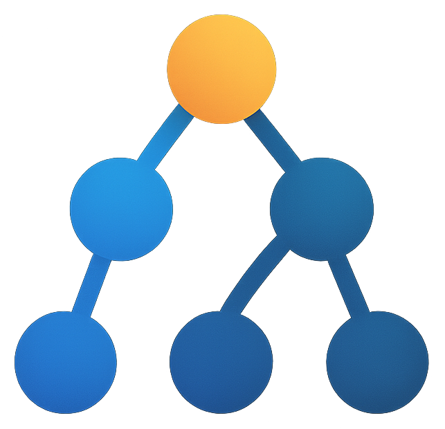

<p align="center">
  
</p>

# AetherGraph

AetherGraph (AG) is a Python-first framework for tool-based workflows. Use native
asynchronous Python for dynamic orchestration, or materialize an explicit task graph
when work needs dependency scheduling, durable waits, persistence, and resumption.

- [Documentation](https://aiperture.github.io/ag-docs/)
- [Runnable examples](https://github.com/AIperture/ag-examples)

## Requirements and installation

- Python 3.11 or newer
- Windows, macOS, or Linux

```bash
python -m pip install aethergraph
```

Optional adapters are installed separately:

```bash
python -m pip install "aethergraph[slack]"
python -m pip install "aethergraph[telegram]"
python -m pip install "aethergraph[webhook]"
python -m pip install "aethergraph[discord]"
```

Pin alpha releases in deployed applications:

```text
aethergraph==0.1.0a19
```

## Quickstart

```python
import asyncio

from aethergraph import NodeContext, graph_fn
from aethergraph.runner import run_async


@graph_fn(name="hello", inputs=["name"], outputs=["message"])
async def hello(name: str, *, context: NodeContext) -> dict[str, str]:
    context.logger().info("building greeting")
    return {"message": f"Hello, {name}!"}


async def main() -> None:
    result = await run_async(hello, {"name": "Ada"})
    print(result["message"])


asyncio.run(main())
```

No model provider is required for this program.

## Programming model

| Primitive | Use it for |
| --- | --- |
| `@graph_fn` | Native async control flow, dynamic branching, and loops |
| `@tool` | Versioned reusable operations with declared inputs and outputs |
| `@graphify` | An explicit `TaskGraph` with scheduler-visible dependencies |
| `NodeContext` | Runtime-scoped services and execution identity |

Decorated tools have two modes. In ordinary Python they execute immediately. While
a `graphify` builder runs, they declare nodes and return handles to named outputs.

```python
from aethergraph import graphify, tool


@tool(outputs=["value"])
def double(value: int) -> dict[str, int]:
    return {"value": value * 2}


@graphify(name="double_graph", inputs=["value"], outputs=["value"])
def double_graph(value: int):
    result = double(value=value)
    return {"value": result.value}
```

Use `graph_fn` by default. Choose `graphify` when the topology, durable execution,
or wait/resume boundary must be explicit.

## Runtime services

Graph functions and tools can declare `*, context: NodeContext`. The context exposes
scoped facades for:

- channels and interaction
- memory events and state history
- artifacts
- revisioned state and operational key-value data
- chat, embedding, and image model profiles
- child runs and cancellation
- triggers, registration, visualization, clocks, and custom services

Obtain these dependencies from the context rather than importing service singletons.

## Server and CLI

Load a graph file and expose the HTTP API:

```bash
aethergraph run double_graph \
  --load-path ./graphs.py \
  --workspace ./aethergraph_workspace \
  --inputs '{"value":0}'

aethergraph serve \
  --project-root . \
  --load-path ./graphs.py \
  --workspace ./aethergraph_workspace \
  --host 127.0.0.1 \
  --port 8745 \
  --strict-load
```

The initial in-process run creates the current workspace manifest required by
0.1.0a19 before server coordination metadata is written. It is needed only when
the local workspace has not been initialized yet.

Run a graph in-process:

```bash
aethergraph run double_graph \
  --load-path ./graphs.py \
  --inputs '{"value":21}'
```

The server publishes OpenAPI at `/openapi.json`, interactive API documentation at
`/docs`, health at `/api/v1/health`, and the optional bundled web client at `/ui`.

## Model configuration

Deterministic graphs need no provider. A minimal chat profile can be configured in
the project's `.env` file:

```ini
AETHERGRAPH_LLM__ENABLED=true
AETHERGRAPH_LLM__DEFAULT__PROVIDER=openai
AETHERGRAPH_LLM__DEFAULT__MODEL=gpt-4o-mini
AETHERGRAPH_LLM__DEFAULT__API_KEY=replace-me
```

Graph code then calls `context.llm("default")`. Embedding and image-generation
profiles use their own configuration sections and do not fall back to chat.

For provider-neutral Tool discovery modes, LLM-call ledger semantics, and the
opt-in cache diagnostic, see
[`docs/tool_discovery_transport.md`](docs/tool_discovery_transport.md).

## Develop the framework

```bash
git clone https://github.com/AIperture/aethergraph.git
cd aethergraph
python -m pip install -e ".[dev]"
pytest -q
ruff check .
black --check .
```

The complete public contracts, configuration, storage rules, interaction model,
and HTTP route map are maintained in the
[AG documentation](https://aiperture.github.io/ag-docs/). Full programs and their
offline verification live in
[`AIperture/ag-examples`](https://github.com/AIperture/ag-examples).
